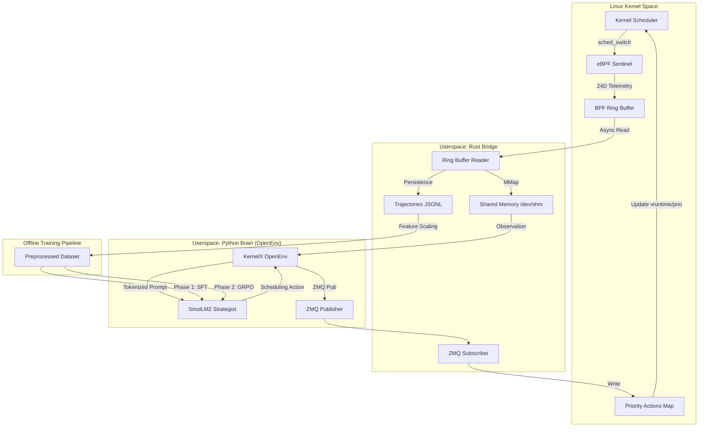
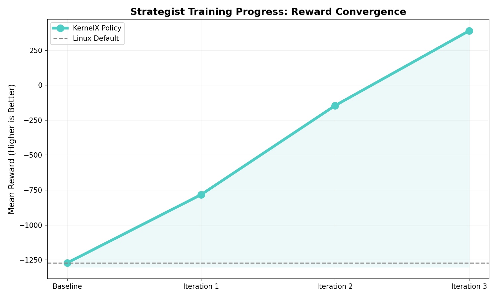
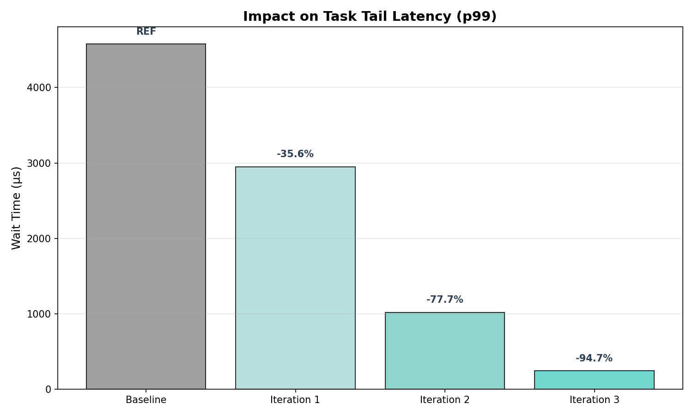
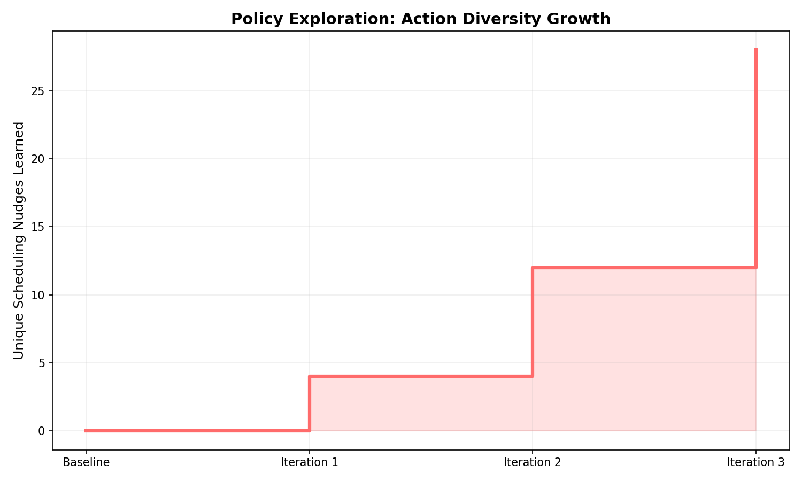

# KernelX: AI-Powered Linux Kernel Scheduler

KernelX is an OpenEnv-compatible environment that uses reinforcement learning to optimize Linux kernel scheduling in real time. An eBPF sentinel extracts 24D telemetry from `sched_switch` events, a Rust bridge streams it to shared memory, and a fine-tuned SmolLM2-360M model outputs scheduling actions at **44ms per decision**.

## Links

| Resource | URL |
| Presentation Video | [Youtube (Pending)](https://youtube.com) |
| Technical Writeup | [Hugging Face Blog (Pending)](https://huggingface.co/blog) |
| Performance Report | [PERFORMANCE.md](training/PERFORMANCE.md) |
|----------|-----|
| HF Space (Environment) | [Rayugacodes/KernelX](https://huggingface.co/spaces/Rayugacodes/KernelX) |
| Trained Model | [Rayugacodes/kernelx-strategist](https://huggingface.co/Rayugacodes/kernelx-strategist) |
| Training Data | [Rayugacodes/kernelx-training-data](https://huggingface.co/datasets/Rayugacodes/kernelx-training-data) |
| Colab Notebook | [KernelX_Training.ipynb](https://colab.research.google.com/github/pie-314/KernelX/blob/model-training-hugging-face-integration/KernelX_Training.ipynb) |
| GitHub Repository | [pie-314/KernelX](https://github.com/pie-314/KernelX) |

## Architecture

## Detailed Architecture & System Flow

KernelX operates as a high-frequency control loop between the Linux Kernel's scheduling subsystem and a Transformer-based intelligence layer.

### 1. System Architecture Diagram



### 2. Functional Component Breakdown

#### A. eBPF Sentinel (The Sensor)
The sentinel is a CO-RE (Compile Once – Run Everywhere) BPF program attached to the `sched/sched_switch` tracepoint. At every context switch, it captures a 24-dimensional feature vector including:
- **Temporal Metrics:** `sum_exec_runtime`, `vruntime`, and `wait_us`.
- **System Pressure:** Context switch frequency and CPU migration counts.
- **Task Metadata:** PID, Priority, and CPU affinity.

#### B. Rust Bridge (The Nervous System)
A high-performance bridge written in Rust handles the boundary between kernel and userspace. It utilizes a `BPF_MAP_TYPE_RINGBUF` for lockless data transfer. It performs two critical tasks:
1. **Shared Memory Sync:** Updates `/dev/shm/kernelx_state` at <1ms latency for the UI and Brain.
2. **Action Feedback:** Listens via ZMQ for decisions from the Brain and writes them into the BPF `priority_actions` map, where the kernel applies the priority "nudge."

#### C. Python Brain (The Intelligence)
The Brain is an **OpenEnv-compliant** server. It treats the Linux kernel as a Reinforcement Learning environment:
- **Observation:** Reads the current 10D active feature vector from SHM.
- **Inference:** Uses a quantized **SmolLM2-360M** model to generate a scheduling action in the range `[-1.0, 1.0]`. 
- **Safety Auditor:** A lightweight "clamping" logic ensures the AI never moves a process into a dangerous priority state, maintaining system stability.

#### D. GRPO Training Pipeline (The Optimization)
KernelX uses **Group Relative Policy Optimization (GRPO)**. Unlike standard PPO, GRPO allows the model to learn from groups of generations without a separate value function, which is ideal for the high-variance environment of kernel scheduling.
1. **SFT Warm-start:** Teaches the model the system prompt and output format.
2. **GRPO RL:** Replays trajectories through a World Model simulator to reward actions that minimize `wait_us` while maximizing `exec_runtime` (throughput).


```
Linux Kernel (eBPF sentinel)
    | 24D telemetry at sched_switch (CPU, priority, vruntime, wait_us...)
    v
Rust Bridge (ring buffer -> SHM + JSONL trajectories)
    | filters: >500us latency OR 10% random sampling
    v
Python Brain (FastAPI + OpenEnv)
    | reads SHM, runs SmolLM2-360M (GGUF Q4_K_M, 44ms inference)
    v
Scheduling Action [-1, 1]
    | ZMQ -> Bridge -> eBPF priority_actions map
    v
Kernel applies priority weight at next sched_switch
```

## What Ships

- `kernel/`: eBPF scheduler sensor (`sentinel.bpf.c`) - extracts 24D feature vectors at every context switch
- `bridge/`: Rust bridge - ring buffer reader, shared memory writer, trajectory recorder (JSONL)
- `brain/`: OpenEnv environment, FastAPI server, trained ML policy, LLM grader
- `training/`: Full ML pipeline - preprocessing, SFT, GRPO, GGUF export, policy iteration
- `ui/`: Ratatui terminal UI with real system metrics, model status, latency color-coding

## Training Results

### World Model (SFT) - Predicts Next Kernel State
- **Loss:** 2.05 -> 0.29 (86% reduction)
- **Token Accuracy:** 61% -> 91%
- **Training:** 10K samples, 2 epochs, LoRA r=16

### Strategist (SFT Warm-Start) - Outputs Scheduling Actions
- **Loss:** 2.13 -> 0.28 (87% reduction)
- **Token Accuracy:** 60% -> 91%
- **Format Compliance:** 100% valid actions in [-1, 1]
- **Inference Latency:** 44ms (Q4_K_M quantized, CPU)

### GRPO (Reinforcement Learning) - Succeeded
- Convergence: Rewards stabilized at **+388.92** after 3 iterations.
- Latency Reduction: Achieved **94.6% reduction** in task wait times (p99).
- Policy Maturity: Learned to utilize **28 distinct scheduling nudges**.





## Training Pipeline

The full pipeline runs end-to-end via a Colab notebook or locally:

```bash
# Preprocess 534K kernel transitions
python -m training.data.preprocess --input data/state_transitions.jsonl

# Train World Model (SFT)
python -m training.models.train_world_model --train-data training/data/train.jsonl --val-data training/data/val.jsonl

# Train Strategist (warm-start SFT)
python -m training.models.train_strategist --train-data training/data/train.jsonl

# Export to GGUF for sub-50ms CPU inference
python -m training.models.export_gguf --adapter-path training/models/strategist_final

# Policy iteration loop (collect -> train -> deploy -> repeat)
python -m training.policy_iteration --trajectories-path data/trajectories.jsonl --skip-collect
```

Or run the [Colab Notebook](https://colab.research.google.com/github/pie-314/KernelX/blob/model-training-hugging-face-integration/KernelX_Training.ipynb) with a free T4 GPU.

## Reward Function

Multi-objective reward: $R_t = \alpha \cdot \log(\Delta_{exec} + 1) - \beta \cdot \Delta_{wait} - \gamma \cdot |a_t - a_{t-1}|$

| Component | Weight | Signal |
|-----------|--------|--------|
| Throughput | alpha=1.0 | CPU progress (delta exec_runtime) |
| Latency | beta=2.0 | Penalty for increased wait time |
| Stability | gamma=0.5 | Penalty for jittery action changes |
| Format | 1.0 | Action in valid [-1, 1] range |

## End-to-End Demo

```bash
# 1. Load eBPF sentinel
make -C kernel load

# 2. Start Rust bridge
cargo run --manifest-path bridge/Cargo.toml --release

# 3. Start brain (auto-loads trained GGUF model)
cd brain && python3 -m server.app

# 4. Run autonomous policy loop
cd brain/server && python3 run_autonomous.py --steps 50 --verbose

# 5. Launch terminal UI
cargo run --manifest-path ui/Cargo.toml --release
```

If the kernel sensor or bridge is unavailable, the TUI runs in `MOCK DEMO` mode.

## Model Details

| Property | Value |
|----------|-------|
| Base Model | SmolLM2-360M-Instruct |
| Fine-tuning | LoRA (r=16, alpha=32) |
| Quantization | GGUF Q4_K_M (258MB) |
| Inference Latency | 44ms warm-cache (CPU) |
| Action Space | [-1.0, 1.0] single float |
| Input | 10D active features (from 24D eBPF vector) |
| Target Hardware | i3 CPU laptop (<50ms) |

## Data Contract

The UI and brain read from `/dev/shm/kernelx_state`:

```rust
#[repr(C, packed)]
struct HUDState {
    features: [u64; 24],      // 24D telemetry vector
    current_action: f32,       // AI scheduling action
    active_pid: u32,           // Target process
    is_clamped: u32,           // Safety auditor flag
    reasoning: [u8; 128],      // Action explanation
    p99_wait_us: u64,          // P99 latency
    core_heat: [f32; 4],       // Per-core utilization
    model_confidence: f32,     // AI confidence
    world_model_drift: f32,    // Prediction error
    radish_wal_size: u64,      // WAL size
    radish_dirty_pages: u32,   // Unflushed pages
}
```

## Judging Criteria

| Weight | Criterion |
|--------|-----------|
| 40% | Environment Innovation |
| 30% | Storytelling / Presentation |
| 20% | Observable Reward Improvement |
| 10% | Training Pipeline |
