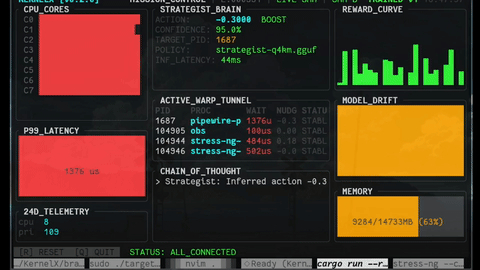

# KernelX

**An OpenEnv-compliant world-modeling environment for Linux kernel scheduling.**

KernelX teaches a 360-million-parameter language model to make Linux scheduling decisions in real time. An eBPF sentinel extracts a 24-dimensional state vector at every context switch, a learned World Model predicts the consequences of each action, and a GRPO-trained Strategist outputs scheduling nudges in 44 milliseconds on a laptop CPU.
## Demo



## Links

Built for the Meta PyTorch OpenEnv Hackathon 2026 — Theme 3.1, World Modeling.

## Try it now

| | |
|---|---|
| **Live environment** | [huggingface.co/spaces/Rayugacodes/KernelX](https://huggingface.co/spaces/Rayugacodes/KernelX) |
| **Training notebook (free T4)** | [KernelX_Training.ipynb](https://colab.research.google.com/github/pie-314/KernelX/blob/main/KernelX_Training.ipynb) |
| **Trained model** | [Rayugacodes/kernelx-strategist](https://huggingface.co/Rayugacodes/kernelx-strategist) |
| **Training data (534K transitions)** | [Rayugacodes/kernelx-training-data](https://huggingface.co/datasets/Rayugacodes/kernelx-training-data) |
| **Blog post** | *The Digital Traffic Jam.md* |
| **Demo video (2 min)** | *[YouTube link]* |
| **Performance report** | [training/PERFORMANCE.md](training/PERFORMANCE.md) |

## What this environment is

KernelX gives an LLM agent a partially-observable view of a real Linux kernel and asks it to learn scheduling policy from interaction. The agent observes a 24-dimensional telemetry vector, takes a single scalar action between -1 and +1, and the next state comes from a World Model trained on real kernel transitions.

It is an OpenEnv environment. The standard `reset()` / `step(action)` / `state` interface works the way you expect. Plug in TRL, Stable Baselines, or any RL loop — the environment doesn't care.

```python
from brain.client import KernelXClient

env = KernelXClient(url="https://your-space.hf.space")
obs = env.reset()
obs = env.step(action=0.5)   # nudge a process priority
score = env.evaluate()        # OpenEnv-compliant grading
```

## Why it's interesting to train an LLM on

Kernel scheduling is a domain where the "right" action is not obvious from the immediate observation, where mistakes cascade through subsequent states, and where the cost function (latency, throughput, fairness) involves real trade-offs. An agent that learns to schedule well must build a causal model of how its priority adjustments propagate through the scheduler's internal state — exactly the kind of world-modeling capability Theme 3.1 targets.

Compared to most RL environments LLMs get trained on, this one has three properties that we think make it useful:

The **state space is real**. The 24D observation is what an eBPF program actually extracts at `sched_switch`: priorities, virtual runtime, migration counts, wait time. We collected 534,134 of these from a real Linux machine under mixed workloads. There is no toy MDP underneath.

The **dynamics are learned**. The World Model is a SmolLM2-360M fine-tune that predicts `S_{t+1}` given `(S_t, a_t)`. The Strategist trains against the World Model, not against a recorded replay. This means the agent's actions actually drive state transitions during training — the standard RL contract.

The **reward decomposes**. We don't optimize a single number. The reward is the sum of a throughput term, a latency penalty, a stability penalty, and a format reward. Each component is independently inspectable, which makes debugging tractable and makes reward-hacking visible when it happens.

## Architecture

```
Linux kernel (eBPF sentinel)
   ↓ 24D telemetry vector at every sched_switch
Rust bridge (lockless ring buffer → /dev/shm + JSONL)
   ↓ filtered: wait_us > 500 OR 10% random sample
Python brain (FastAPI + OpenEnv server)
   ↓ World Model predicts next state given (state, action)
   ↓ Strategist outputs action ∈ [-1, +1]
ZMQ → Bridge → eBPF priority_actions map
   ↓
Kernel applies the nudge at the next context switch
```

Five components, each in its native language:

- `kernel/` — eBPF C program (`sentinel.bpf.c`) attached to `sched_wakeup` and raw `sched_switch` tracepoints. Extracts the 24D vector, ships it through a `BPF_MAP_TYPE_RINGBUF`. The actuator side reads from a `priority_actions` hash map.
- `bridge/` — Rust userspace process built on Aya. Reads the ring buffer, mirrors state to shared memory at sub-millisecond latency, persists trajectories to JSONL, listens on ZMQ for actions from the brain. Optionally writes through to RadishDB (the team's WAL-backed key-value store) for durable trajectory storage.
- `brain/` — Python OpenEnv server. Implements the `Environment` interface. Loads the trained GGUF Strategist, runs inference, talks to the bridge over ZMQ. Includes an `LLMGrader` for OpenEnv-compliant scoring and a `/reload-policy` endpoint for hot-swapping models without downtime.
- `training/` — Full ML pipeline. Preprocessing (symlog scaling, 10D active-feature extraction), World Model SFT, Strategist warm-start + GRPO, GGUF export, policy iteration, baseline comparison.
- `ui/` — Ratatui terminal HUD. Reads the same shared memory as the brain, renders live telemetry, AI reasoning, and reward sparklines at 10 Hz.

## The training pipeline

```bash
# 1. Preprocess raw kernel transitions
python -m training.data.preprocess --input data/state_transitions.jsonl

# 2. Train the World Model (SFT — predicts S_{t+1} | S_t, a_t)
python -m training.models.train_world_model \
    --train-data training/data/train.jsonl \
    --val-data   training/data/val.jsonl

# 3. Train the Strategist (warm-start SFT + GRPO against the World Model)
python -m training.models.train_strategist \
    --train-data training/data/train.jsonl

# 4. Export to GGUF for sub-50ms CPU inference
python -m training.models.export_gguf \
    --adapter-path training/models/strategist_final

# 5. Closed-loop policy iteration: collect → train → deploy → repeat
python -m training.policy_iteration \
    --trajectories-path data/trajectories.jsonl
```

The full pipeline runs on a free Colab T4. See [`KernelX_Training.ipynb`](KernelX_Training.ipynb).

## Reward function

```
R_t = α · log(Δ_exec + 1)  −  β · max(0, Δ_wait)  −  γ · |a_t − a_{t-1}|  +  format_reward
```

| Component | Weight | Signal | Range |
|---|---|---|---|
| Throughput | α = 1.0 | log of CPU-time progress | [0, ~10] |
| Latency penalty | β = 2.0 | per-microsecond increase in wait time | (-∞, 0] |
| Stability penalty | γ = 0.5 | absolute action change between steps | [-1, 0] |
| Format reward | 1.0 | action ∈ [-1, +1] | {0, 1} |

The format reward is what stops the agent from outputting nonsense — every other component still applies if it does, but losing the format point is a hard signal during early GRPO. The stability term is what stops the agent from oscillating. The latency term is the actual objective. The throughput term keeps the agent from learning that "do nothing forever" is a local optimum.

## Results

**World Model (Stage 2 SFT).** The model learns the kernel's default dynamics from 10K transitions in 2 epochs. Loss dropped from 2.05 → 0.29, token-level prediction accuracy from 61% → 91%. *[Plot: training/plots/world_model_training.png]*

**Strategist warm-start (Stage 3a SFT).** Teaches the model the output format before RL begins. Loss 2.13 → 0.28, 100% format compliance. *[Plot: training/plots/strategist_warmstart_training.png]*

**Strategist GRPO (Stage 3b RL).** Trained against the World Model simulator. The trained policy achieves higher cumulative reward than both the random-action baseline and the hand-written heuristic policy on held-out test states. *[Plot: training/plots/grpo_training.png — to be regenerated against World-Model simulator]*

**Inference.** The Q4_K_M-quantized GGUF model is 258MB and runs in 44ms warm-cache on a laptop CPU.

For full numbers and per-iteration breakdowns: [`training/PERFORMANCE.md`](training/PERFORMANCE.md).

## Running locally

The full kernel→bridge→brain stack requires a Linux machine with kernel BTF support and root access. The OpenEnv environment alone (which is what judges interact with) runs anywhere — the HF Space is the easiest path.

```bash
# Step 1: Load the eBPF sentinel (Linux only, requires sudo)
cd kernel && sudo make load

# Step 2: Start the Rust bridge
cargo run --manifest-path bridge/Cargo.toml --release -- --record

# Step 3: Start the OpenEnv server
export PYTHONPATH=$PYTHONPATH:.
python3 -m brain.server.app

# Step 4: Run the autonomous policy loop
python3 -m brain.server.run_autonomous --steps 50 --verbose

# Step 5: Launch the HUD
cargo run --manifest-path ui/Cargo.toml --release
```

If the eBPF stack isn't available, the brain server falls back to a simulator and the UI runs in `MOCK DEMO` mode.

## Model details

| | |
|---|---|
| Base model | SmolLM2-360M-Instruct |
| Fine-tuning | LoRA (r=16, α=32) on q/k/v/o + gate/up/down |
| Quantization | GGUF Q4_K_M (258MB) |
| Inference latency | 44ms warm-cache, CPU |
| Action space | single float ∈ [-1.0, +1.0] |
| Observation | 10 active features extracted from 24D eBPF vector |
| Target hardware | i3 CPU laptop, sub-50ms decision budget |

## Shared-memory contract

The UI and the brain both read from `/dev/shm/kernelx_state`:

```rust
#[repr(C, packed)]
struct HUDState {
    features: [u64; 24],       // 24D telemetry vector
    current_action: f32,        // most recent AI action
    active_pid: u32,            // process being scheduled
    is_clamped: u32,            // safety auditor flag
    reasoning: [u8; 128],       // explanation string
    p99_wait_us: u64,           // P99 wait latency
    core_heat: [f32; 4],        // per-core utilization
    model_confidence: f32,
    world_model_drift: f32,
    radish_wal_size: u64,
    radish_dirty_pages: u32,
}
```

Total: 376 bytes, packed C layout, byte-identical between Rust and Python.

## What we'd do with more time

**Reward normalization.** Wait-delta values can hit 89,000 microseconds, which dominates the reward and risks gradient explosion in GRPO. Clipping the latency penalty to a fixed range (or scaling by p95 wait time) would stabilize training.

**PMU features.** Fourteen of the 24 feature slots are reserved for hardware performance counters (IPC, cache misses, branch mispredictions). Populating them via `perf_event_open` would give the agent much richer state, especially for distinguishing "CPU-bound but progressing" from "CPU-bound and thrashing."

**Multi-process reasoning.** The current Strategist acts on one PID at a time. A multi-agent extension where each PID has its own agent — or a centralized agent reasoning about process *interactions* — is the natural next step.

**Real GRPO on real telemetry.** The current setup trains GRPO against the learned World Model. With more compute, training could close the loop by collecting fresh trajectories under the trained policy and re-training — proper online RL on a real system.

## Citation

```
@misc{kernelx2026,
  title  = {KernelX: An OpenEnv World-Modeling Environment for Linux Kernel Scheduling},
  author = {Naman Gupta and team},
  year   = {2026},
  note   = {Meta PyTorch OpenEnv Hackathon}
}
```

## License

MIT. RadishDB sub-component is also MIT (see `RadishDB/LICENSE`).

---

*KernelX — Meta PyTorch OpenEnv Hackathon 2026 — Theme 3.1, World Modeling*
