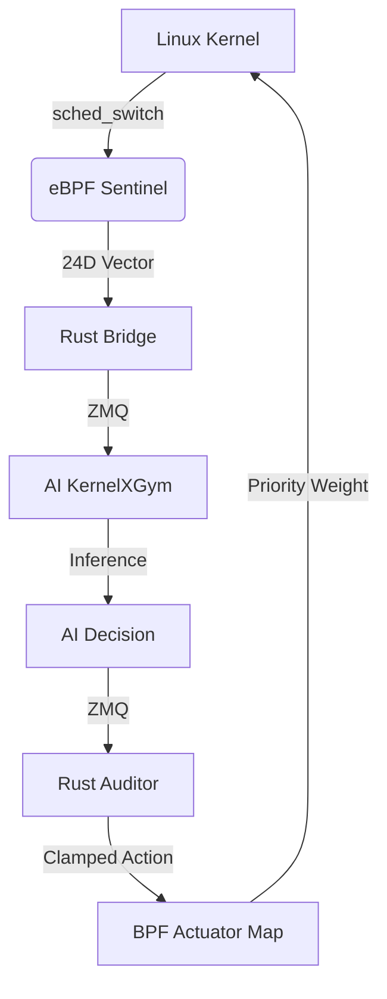

# KernelX: Strategic Execution Plan

This document provides a descriptive roadmap for the KernelX development team. It explains the "Why" and "How" of our next steps to transform our high-speed telemetry into an autonomous scheduling system.

---

## 1. The Core Infrastructure (Status: Implemented)
We have successfully built the **Metal Layer**.
- **The Sensor:** `sentinel.bpf.c` now extracts a **24-Dimensional State Vector** per process switch. This includes VRuntime, migration counts, per-CPU stats, and micro-latency.
- **The Actuator:** An eBPF Hash Map (`priority_actions`) is now ready. When the AI writes a PID and a weight to this map, the kernel-side code is primed to intercept and apply it.
- **The Bridge:** Our Rust bridge is now compatible with this 24D data stream and is capable of processing thousands of events per second with zero-copy efficiency.

---

## 2. Immediate Team Assignments

### 🛠️ Systems Lead: "The Database & FFI"
Your goal is to ensure the AI has a "memory."
- **Task 1: RadishDB Integration.** Build the `libradish.a` static library.
- **Task 2: Persistent Logging.** Use FFI to call RadishDB from the Rust bridge. Every 24D vector we see must be logged to a high-speed Write-Ahead Log (WAL).
- **Task 3: Actuator Writing.** Implement the function in Rust that takes a decision from the AI and writes it into the `priority_actions` BPF map.

### 🧠 AI Lead: "The Intelligence & IPC"
Your goal is to build the brain that speaks to the bridge.
- **Task 1: ZeroMQ Handshake.** Implement a ZMQ `PULL` socket in the Python Gym environment (`kernelx_gym.py`). This will receive the 24D vectors from the Rust Bridge.
- **Task 2: Shadow Mode.** Don't try to optimize yet! Just collect data. Train a simple model to *predict* what the default Linux scheduler will do. This is our "Safety Baseline."
- **Task 3: Reward Calibration.** Mathematically verify that our reward function (Throughput vs. Latency) is stable under heavy load.

### 🛡️ Governance Lead: "The Auditor & Viz"
Your goal is to ensure the AI doesn't "kill" the system.
- **Task 1: The Auditor.** Write the `auditor.rs` module. It must have a "Deny List" of PIDs (like PID 1, SSH, etc.) that the AI is never allowed to touch.
- **Task 2: Real-time HUD.** Use the 24D data stream to build a TUI (Terminal UI). We need to see the "Cache Misses" and "Wait Times" as live gauges so we can spot anomalies during testing.

---

## 3. The Execution Flow

---

## 4. Why This Matters (The Human Side)
We aren't just building a scheduler; we are building a **Cognitive Operating System**. 
- **The 24D Vector** is the system's "vision."
- **RadishDB** is its "memory."
- **PPO RL** is its "intelligence."
- **The Auditor** is its "conscience."

**Next Step for Everyone:**
Review the `sentinel_event.h` file. This is our "Interface Contract." Every component you build must respect the byte-layout of the 24D vector defined there.

**Lead's Note:** Our first milestone is **"Observation Parity."** We must prove that the AI can "see" a cache-thrashing event in the telemetry before we allow it to "act" on it.
